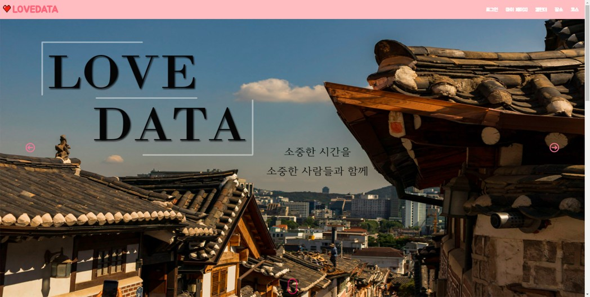
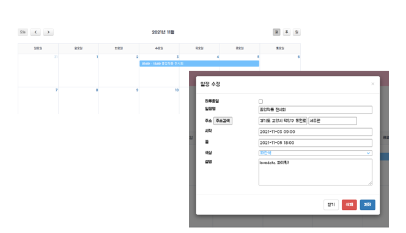
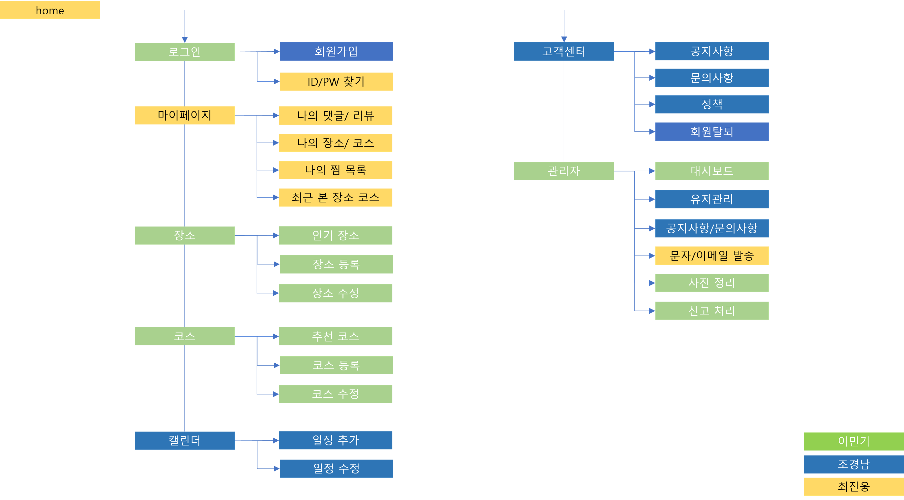

# Love Data

    

**데이트 장소 및 코스 추천·공유 웹 서비스**

 

## 📌 프로젝트 소개

Love Data는 데이트 코스와 장소 추천 및 공유를 목적으로 설계된 웹 서비스입니다.  
사용자가 데이트 코스를 쉽게 계획하고, 다양한 장소를 추천받을 수 있도록 돕습니다.  
이동 수단, 숙박 정보, 집콕 데이트 등 다양한 옵션을 제공하여 사용자에게 효율적인 데이트 계획 수립을 지원합니다.

 

## 📑 목차

1. [개발 인원](#-개발-인원)
2. [팀원별 역할](#-팀원별-역할)
3. [개발 환경](#-개발-환경)
4. [주요 기능](#-주요-기능)
5. [프로젝트 구성도](#-프로젝트-구성도)
6. [참고 자료 및 사용 도구](#-참고-자료-및-사용-도구)
7. [문서 및 링크](#-문서-및-링크)

 

## 👥 개발 인원

| 이민기 | 조경남 | 최진웅 |
|:---:|:---:|:---:|
|    [@mon0mon](https://github.com/mon0mon) |    [@GyeongNam](https://github.com/GyeongNam) |    [@dorumamu](https://github.com/dorumamu) |

 

## 🔧 팀원별 역할

### 이민기
- **로그인 기능 구현**  
  사용자가 사이트에 접근하기 위해 로그인하는 시스템을 개발하였습니다. 소셜 로그인(네이버)을 포함하여 안전하고 편리한 인증 과정을 제공합니다.
- **장소 관리 기능 개발**  
  사용자가 장소를 등록, 검색, 수정, 삭제할 수 있는 기능을 설계하고 구현했습니다. 장소의 상세 정보를 표시하며, 해시태그 기반 필터링 및 지도 API(TMap)를 활용하여 직관적인 탐색 경험을 제공합니다.
- **코스 추천 및 관리**  
  다중 장소를 조합하여 코스를 생성하고 사용자 리뷰를 바탕으로 코스를 추천하는 시스템을 개발했습니다. 코스의 경로는 지도 및 예상 비용을 함께 제공하여 사용자의 편의를 도모했습니다.
- **어드민 페이지 구현**  
  관리자 전용 페이지를 통해 전체 데이터(유저, 장소, 코스 등)를 관리할 수 있도록 기능을 개발했습니다.
- **업로드 캐시 관리**  
  삭제된 이미지 데이터가 서버에 남지 않도록 관리 및 정리하는 시스템을 구현했습니다.
- **신고 센터**  
  사용자가 부적절한 콘텐츠(댓글, 장소 등)를 신고할 수 있는 기능과 이를 관리자가 처리할 수 있는 신고 센터를 개발했습니다.

 

### 조경남
- **회원가입 시스템 구축**  
  사용자가 서비스를 이용하기 위해 회원가입을 할 수 있도록 기능을 개발했으며, 휴대폰 인증을 통한 보안 강화와 약관 동의 절차를 포함했습니다.
- **캘린더 기능 개발**  
  사용자 개인 일정 관리를 위한 캘린더 기능을 설계했습니다. 사용자가 원하는 날짜에 일정을 등록, 수정, 삭제할 수 있도록 구현했습니다.
- **고객센터 기능 구현**  
  공지사항 열람 및 Q&A 문의를 할 수 있는 고객센터를 설계했습니다. 비공개 설정 및 문의 유형 선택 등의 세부 기능도 포함되었습니다.
- **어드민(유저 관리)**  
  관리자가 유저 데이터를 확인하고 특정 유저를 제재(정지, 신고 처리)할 수 있도록 유저 관리 시스템을 설계했습니다.
- **어드민(공지/문의사항 관리)**  
  관리자가 공지사항을 작성, 수정, 삭제하고, 사용자의 문의사항에 답변할 수 있도록 기능을 개발했습니다.
- **회원탈퇴 프로세스 설계**  
  회원 탈퇴 절차를 사용자 친화적으로 설계하였으며, 탈퇴 시 비밀번호 확인과 함께 관련 데이터를 처리하는 기능을 구현했습니다.

 

### 최진웅
- **어드민 메시지 발송 시스템 개발**  
  관리자가 유저에게 SMS 또는 이메일로 메시지를 전송할 수 있는 기능을 구현했습니다. 유저 상태 및 활동 내역에 따라 타겟팅 메시지 발송이 가능합니다.
- **마이페이지 개발**  
  사용자가 자신의 활동 내역(작성한 댓글, 리뷰, 찜한 장소 및 코스 등)을 한눈에 확인하고 관리할 수 있도록 설계했습니다.
- **디자인 및 CSS 구현**  
  사용자 인터페이스(UI)와 스타일을 설계 및 구현하여 웹페이지의 시각적 완성도를 높였습니다.
- **회원정보 찾기 기능 구현**  
  사용자가 휴대폰 번호와 이메일을 통해 아이디/비밀번호를 찾고 재설정할 수 있는 기능을 개발했습니다.
- **홈 화면 개발**  
  주요 서비스(장소, 코스 추천 등)를 강조하며, 사용자에게 친숙한 인터페이스로 홈 화면을 설계했습니다. 공지사항과 추천 콘텐츠가 포함됩니다.

 

## ⚙️ 개발 환경

    
    
    
    
    
    

 

## 🛠 주요 기능

1. **장소 관리**

    
   
    - 장소 검색 및 추천 (장소명/해시태그 필터 지원).
    - 장소 상세보기: 상세 정보, 리뷰, 좋아요 및 신고 기능.
    - 사용자 장소 등록/수정/삭제.

2. **코스 관리**
   
   
    - 다중 장소를 포함한 코스 생성 및 추천.
    - 코스 경로: TMap API를 활용한 경로 안내.
    - 코스 리뷰 및 공유 기능.

3. **캘린더 및 일정**

    
    - 사용자 일정 등록 및 관리.
    - 일정 수정 및 삭제 기능.

4. **관리자 기능**
   
   
    - 신고 처리 및 사용자 제재.
    - 유저 활동 데이터 분석 및 관리.

 

## 📂 프로젝트 구성도

### ERD 다이어그램

### 클래스 다이어그램

### 시스템 구성도

 

## 📚 참고 자료 및 사용 도구

- **Spring Boot 공식 문서**: [Spring Boot Documentation](https://spring.io/projects/spring-boot)
- **MySQL 공식 문서**: [MySQL Documentation](https://dev.mysql.com/doc/)
- **TMap API**: [TMap API Documentation](https://openapi.sk.com/)
- **도로명 주소 API**: [도로명 주소 검색 API](https://www.juso.go.kr/openIndexPage.do)

 

## 🔗 문서 및 링크

- **[발표 자료](./docs/Lovedata.pptx)**

 
